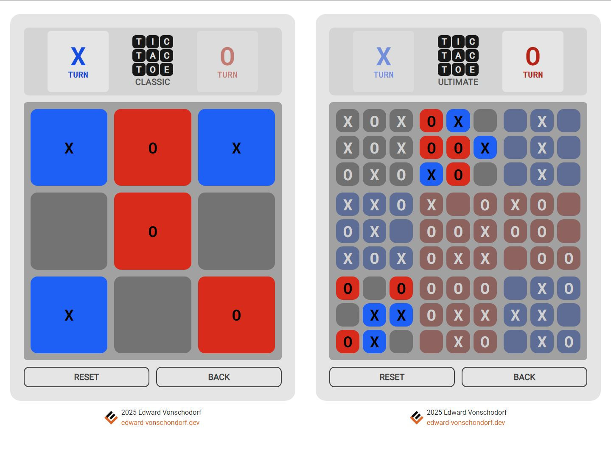

# Tic Tac Toe in React

What was initially a vanilla javascript project is now a React + TypeScript + Vite + TailwindCSS project. This project is a combination of my two previous Tic Tac Toe projects but made with React instead of vanilla JavaScript and the canvas element. 

My previous projects:
- [Tic Tac Toe Ultimate](https://github.com/Torvec/tic-tac-toe-ultimate)
- [Tic Tac Toe Classic](https://github.com/Torvec/tic-tac-toe-classic)

## Features
- Play classic Tic Tac Toe on a single 3x3 grid or play Ultimate Tic Tac Toe on nine 3 x 3 grids.
- Play against a friend (locally)
- Playable with mouse or touch enabled devices.

## Play Now

[Cloudflare Workers Deployment](https://tic-tac-toe.edward-vonschondorf.dev/)